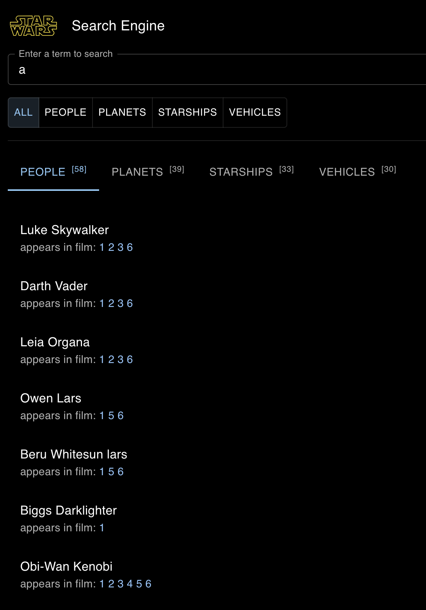
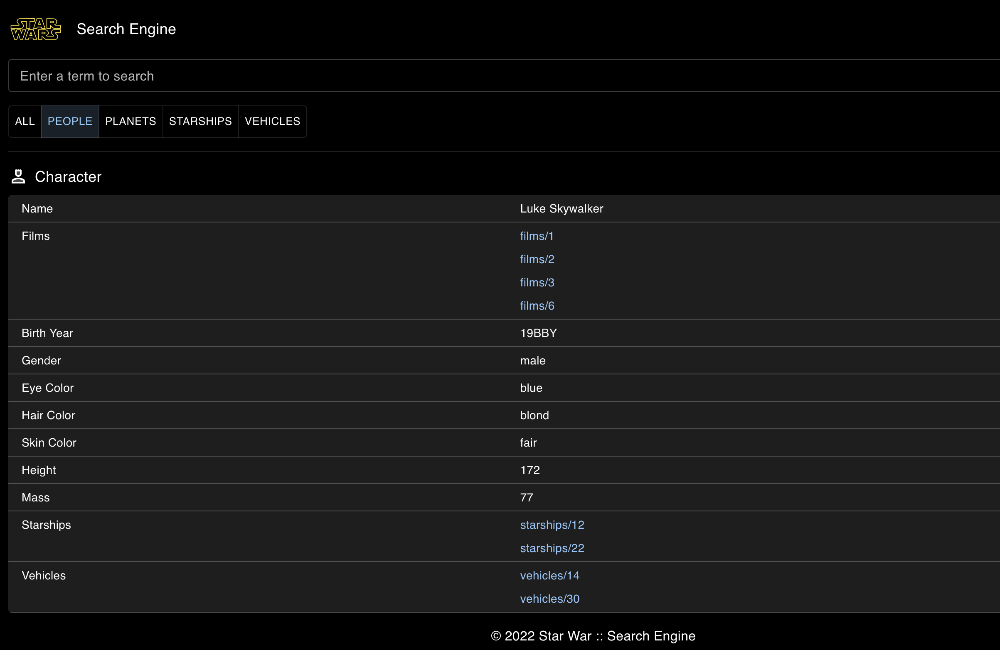

# Star War Search Engine

Toy project

## Getting Started

#### Download source

Open a terminal and run the following commands:

```bash
$ git clone https://github.com/jscriptcoder/star-war-search-engine.git
$ cd star-war-search-engine
```

#### Installing and running development env

Install all the dependencies:

```bash
$ cd /path/to/star-war-search-engine
$ npm install
```

Now run the development environment in the first terminal:

```bash
$ npm start
```

The application runs on http://localhost:3000/

Have fun 😊

## Sneak Peek

#### Home page:


#### Search results page:


#### Details page:
